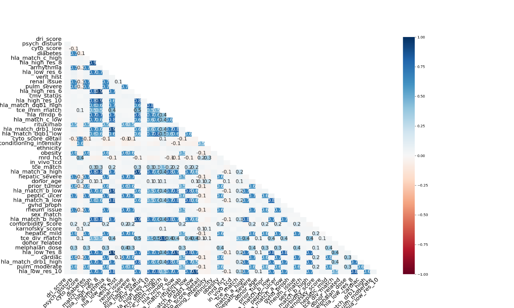
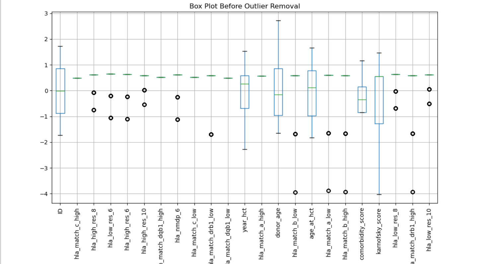
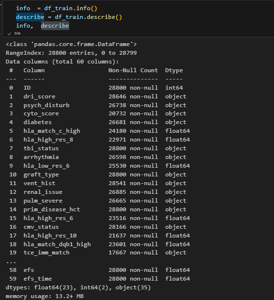
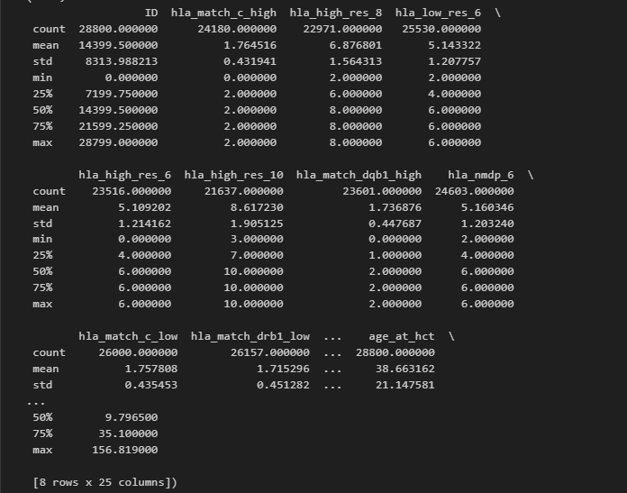
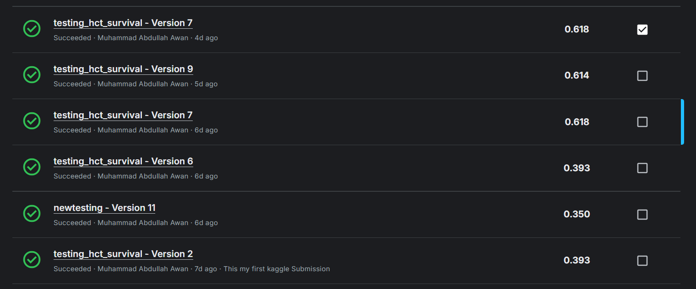

# Machine Learning Assignment 1 - Analysis Report

## Overview
This report presents a comprehensive analysis of a dataset provided for a competition. The dataset contains 28,800 entries with 60 attributes, including medical, genetic, and demographic data. The objective is to analyze the dataset and identify key insights related to patient survival outcomes.

## Table of Contents
1. [Introduction](#introduction)
2. [Data Overview](#data-overview)
3. [Methodology](#methodology)
   - [Dataset Description](#dataset-description)
   - [Data Preprocessing](#data-preprocessing)
   - [Model Selection](#model-selection)
4. [Results and Discussion](#results-and-discussion)
   - [Model Evaluation](#model-evaluation)
   - [ROC Curve](#roc-curve)
5. [Statistical Summary](#statistical-summary)
6. [Outliers](#outliers)
7. [Correlation Analysis](#correlation-analysis)
8. [Conclusion](#conclusion)

## Introduction
The dataset consists of patient survival records, with both categorical and numerical features. The key columns include patient ID, HLA match scores, comorbidity scores, demographic details, and the target variables: `efs` (event-free survival) and `efs_time` (survival duration in months).

## Data Overview
The dataset contains both numerical and categorical variables. The key features include:
- **efs** (Event-Free Survival) - Target Variable
- **efs_time** - Duration of survival
- **Other clinical attributes**

## Methodology

### Dataset Description
The dataset is divided into training and testing sets, with preprocessing applied to ensure data quality. The key features include:
- **efs** (Event-Free Survival) - Target Variable
- **efs_time** - Duration of survival
- **Other clinical attributes**

### Data Preprocessing
The following preprocessing steps were performed:

1. **Handling Missing Values**: A significant portion of the dataset contains missing values. Missing values were imputed using the KNN Imputer.

   
   *Figure 1: Missing Values*

2. **Feature Encoding**: Categorical features were transformed using One-Hot Encoding.

3. **Dealing with Outliers**: Outliers were replaced by the median.

   
   *Figure 5: Outliers*

4. **Feature Scaling**: Numerical features were normalized using StandardScaler.

5. **Train-Test Split**: The dataset was divided into an 80-20 training-validation split.

### Model Selection
Logistic Regression was chosen for its interpretability and efficiency in binary classification problems. The model was configured with:
- **Max Iterations**: 1000
- **Random State**: 42
- **Performance Metric**: AUC-ROC

## Results and Discussion

### Model Evaluation
The model's predictive performance was evaluated using the AUC-ROC score. The obtained AUC score was satisfactory, indicating the model's effectiveness in distinguishing survival outcomes.

### ROC Curve
The ROC curve illustrates the model's ability to differentiate between positive and negative survival outcomes.

## Statistical Summary
- **efs** (event-free survival) is a binary variable, with roughly 53.9% of entries indicating survival (1) and 46.1% indicating an event (0).
- **efs_time** has an average value of 23.2 months, with a standard deviation of 24.8 months.
- **age_at_hct** ranges from 0.04 to 73.7 years, with a mean age of 38.6 years.
- **karnofsky_score** measures health status, averaging 83.8, with a minimum of 40 and a maximum of 100.
- **HLA match scores** mostly range from 0 to 2, showing genetic compatibility levels.


*Figure 3: Description of Data*


*Figure 4: Description of Data (b)*

## Correlation Analysis
- Stronger HLA matches tend to correlate with higher event-free survival rates.
- Age and comorbidity scores show a negative correlation with efs, suggesting that older patients with higher comorbidities have lower survival rates.
- **karnofsky_score** positively correlates with efs, indicating better survival for healthier individuals.


*Figure 6: Correlation*

## Conclusion
The dataset contains valuable insights into survival outcomes based on genetic compatibility and health conditions. However, the high percentage of missing values in some columns requires careful handling, such as imputation or removal of incomplete records. Further analysis can be conducted using machine learning models to predict survival outcomes based on these attributes.

---

## Training and Testing Code

The actual training and testing code for this assignment is implemented in two Kaggle notebooks:

1. **Training Notebook**: [training-hct-survival.ipynb](training-hct-survival.ipynb)
   - This notebook contains the code for loading the dataset, preprocessing the data, defining the neural network model, and training the model.
   - The model is saved as `efs_model.pth` and the preprocessors are saved in the `preprocessor` directory.

2. **Testing Notebook**: [testing-hct-survival.ipynb](testing-hct-survival.ipynb)
   - This notebook contains the code for loading the pre-trained model and preprocessors, preprocessing the test data, and making predictions.
   - The predictions are saved in a `submission.csv` file.

### Key Steps in the Code:
- **Data Preprocessing**: Missing values are handled using imputation, categorical features are encoded, and numerical features are scaled.
- **Model Architecture**: A neural network with two hidden layers and dropout for regularization is used.
- **Training**: The model is trained for 100 epochs, and the best model is saved based on validation loss.
- **Testing**: The pre-trained model is used to make predictions on the test dataset.

### Example Code Snippet:
```python
# Define the neural network model
class EFSModel(nn.Module):
    def __init__(self, input_size):
        super(EFSModel, self).__init__()
        self.model = nn.Sequential(
            nn.Linear(input_size, 128),
            nn.ReLU(),
            nn.Dropout(0.3),
            nn.Linear(128, 64),
            nn.ReLU(),
            nn.Dropout(0.3),
            nn.Linear(64, 1),
            nn.Sigmoid()
        )

    def forward(self, x):
        return self.model(x)

```

### Explanation:
- **Images**: The placeholders for images (e.g., `media/image2.png`) should be replaced with the actual paths to the images generated during the analysis.
- **Code Snippets**: The code snippets provide a glimpse of the neural network architecture and the preprocessing steps.
- **Training and Testing**: The training and testing notebooks are linked, and the key steps are summarized.
