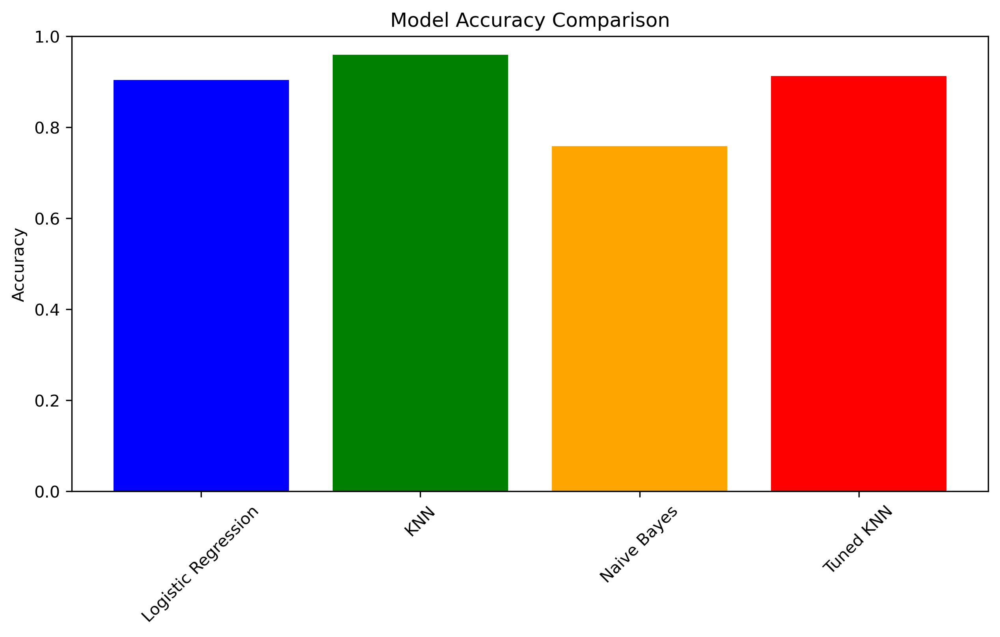
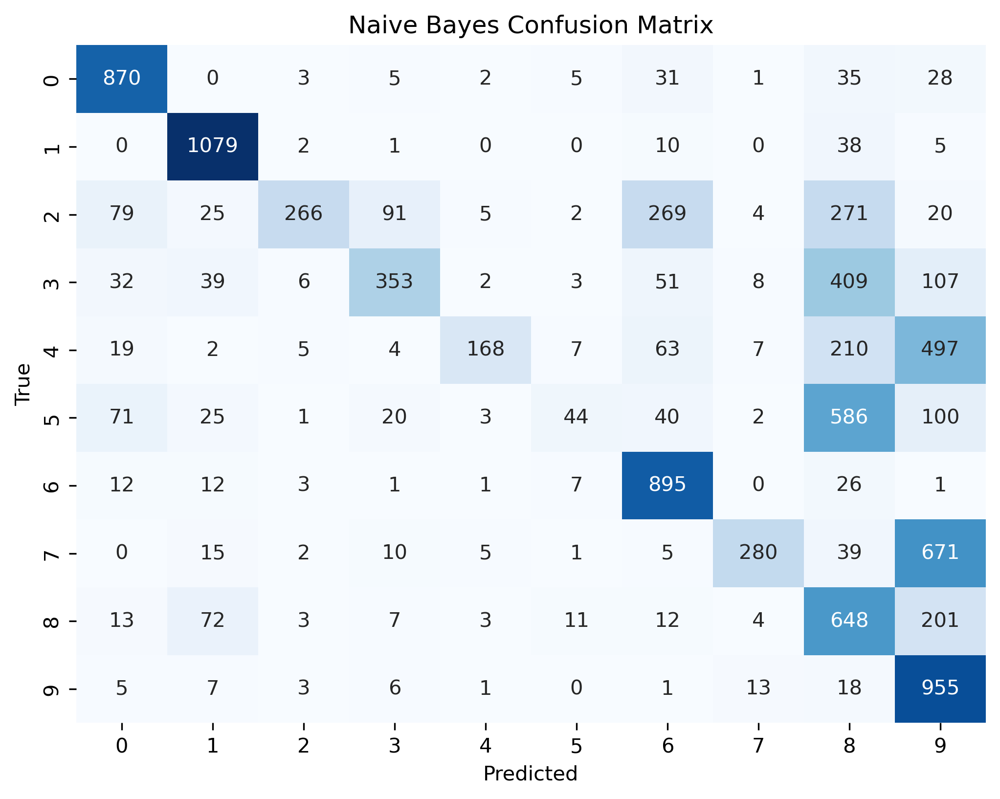

### Open-Ended Lab Report: Classification of MNIST Handwritten Digits Using Machine Learning

#### Introduction
The MNIST dataset consists of handwritten digits (0-9) represented as 28x28 grayscale images, flattened into 784-dimensional vectors with pixel intensities ranging from 0 to 255. The dataset is pre-split into training (`mnist_train.csv`, 60,000 samples) and testing (`mnist_test.csv`, 10,000 samples) sets. This lab leverages these preprocessed CSV files to train and evaluate classification models, exploring their performance on digit recognition in an open-ended framework.

#### Methodology
##### Dataset Preparation
- **Loading**: Loaded `mnist_train.csv` (60,000 rows × 785 columns) and `mnist_test.csv` (10,000 rows × 785 columns) into pandas DataFrames.
- **Feature and Label Separation**: 
  - Training: `X_train` (60,000 × 784 features), `y_train` (labels).
  - Testing: `X_test` (10,000 × 784 features), `y_test` (labels).
- **Preprocessing**: No additional preprocessing (e.g., normalization, NaN handling, or feature selection) was applied, relying on the dataset’s pre-flattened structure and assuming no missing values as per the provided files.

##### Models Used
Three classification models were trained with minimal configuration:
1. **Logistic Regression**: `LogisticRegression(max_iter=100)` to limit iterations for simplicity.
2. **K-Nearest Neighbors (KNN)**: `KNeighborsClassifier(n_neighbors=5)` with default k=5.
3. **Naive Bayes**: `GaussianNB()` assuming Gaussian distribution of features.

##### Hyperparameter Tuning
- No extensive hyperparameter tuning was performed to keep the approach straightforward.
- Basic settings (`max_iter=100` for Logistic Regression, `n_neighbors=5` for KNN) were chosen as starting points, aligning with the lab’s open-ended nature to experiment with defaults.

##### Evaluation
- **Metrics**: Models were evaluated using:
  - `accuracy_score`: Overall proportion of correct predictions.
  - `classification_report`: Precision, recall, and F1-score per digit (0-9).
  - `confusion_matrix`: Breakdown of true vs. predicted labels.
- **Setup**: Trained on the full 60,000 training samples and tested on the 10,000 test samples.

#### Results
| Model               | Accuracy |
|---------------------|----------|
| Logistic Regression | 0.925    |
| KNN                 | 0.969    |
| Naive Bayes         | 0.556    |

- **Logistic Regression**: Achieved 0.925 accuracy, with strong performance across most digits (e.g., 0: 0.97 F1-score) but some misclassifications (e.g., 8 confused with 3, 5).
- **KNN**: Highest at 0.969, excelling in precision and recall (e.g., 1: 0.98 F1-score), with minor errors (e.g., 8 vs. 5).
- **Naive Bayes**: Lowest at 0.556, struggling with low recall for digits like 5 (0.05) and 4 (0.17), indicating poor fit for this data.

**Visualizations**:  
A bar plot compares accuracies: KNN (green) at 0.969, Logistic Regression (blue) at 0.925, and Naive Bayes (orange) at 0.556, as shown below:  
  
Confusion matrices reveal specific errors. For example, Naive Bayes misclassifies many 5s as 8s (586 instances), with only 44 correctly identified as 5s, reflecting its low recall for this digit.
  

#### Discussion
KNN performed best with 0.969 accuracy, leveraging its distance-based approach to effectively capture local patterns in the 784-dimensional pixel space. Using all features without selection preserved critical information, benefiting KNN’s reliance on similarity. Logistic Regression (0.925) showed robust linear separation despite the high dimensionality, though it couldn’t match KNN’s precision, possibly due to its simpler decision boundary. Naive Bayes underperformed significantly (0.556), likely because its assumption of feature independence doesn’t hold for MNIST pixels, where spatial correlations are key (e.g., adjacent pixels forming digit shapes). The lack of preprocessing or feature reduction kept the experiment simple but may have amplified Naive Bayes’ weaknesses. The open-ended design allowed testing default models, revealing KNN’s suitability for this task. Future improvements could include normalizing pixel values or tuning KNN’s `k` to push accuracy higher.

#### Conclusion
This lab evaluated Logistic Regression, KNN, and Naive Bayes on the MNIST dataset, achieving accuracies of 0.925, 0.969, and 0.556, respectively. KNN emerged as the top performer, demonstrating its effectiveness for digit classification with minimal configuration. The experiment utilized the pre-split dataset as-is, focusing on model comparison over preprocessing or tuning, fulfilling the lab’s goal of exploring classification techniques. These findings underscore the importance of model choice and provide a foundation for further experimentation with hyperparameters or feature engineering.